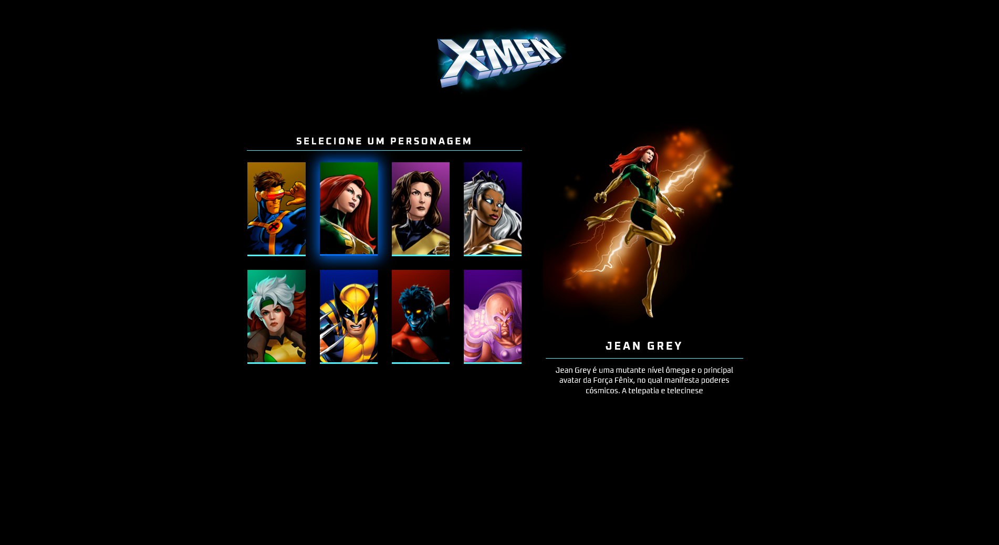

# Projeto X-Men: Seleção de Personagens

> Projeto de seleção interativa de personagens dos X-Men, desenvolvido para praticar conceitos de HTML, CSS (com responsividade) e JavaScript. Interface moderna com efeitos de destaque e animações suaves.

### 🔄 Ajustes e melhorias

O projeto foi finalizado com as seguintes funcionalidades:

- [x] Estrutura de cards de personagens em HTML semântico
- [x] Estilização com CSS3, variáveis e tema neon/dark
- [x] Responsividade para desktop, tablet e mobile
- [x] Efeitos de seleção interativa e troca de imagens com fade

## 💻 Pré-requisitos

Antes de começar, verifique se você atendeu aos seguintes requisitos:

- Você instalou a versão mais recente do navegador Google Chrome, Firefox ou Edge.
- Você tem uma máquina Windows, Linux ou Mac.
- Você leu a documentação básica sobre HTML, CSS e JavaScript.

## 😄 Seja um dos contribuidores
- Quer fazer parte desse projeto? Clique [AQUI](CONTRIBUTING.md) e leia como contribuir.
